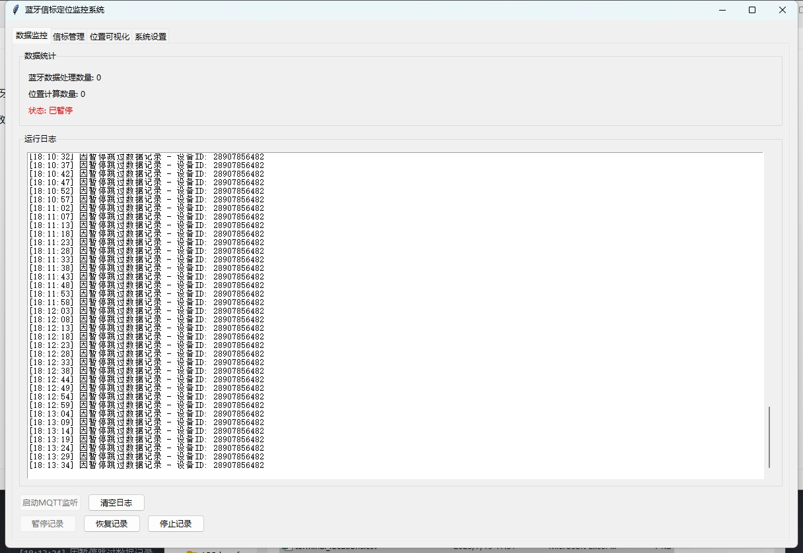
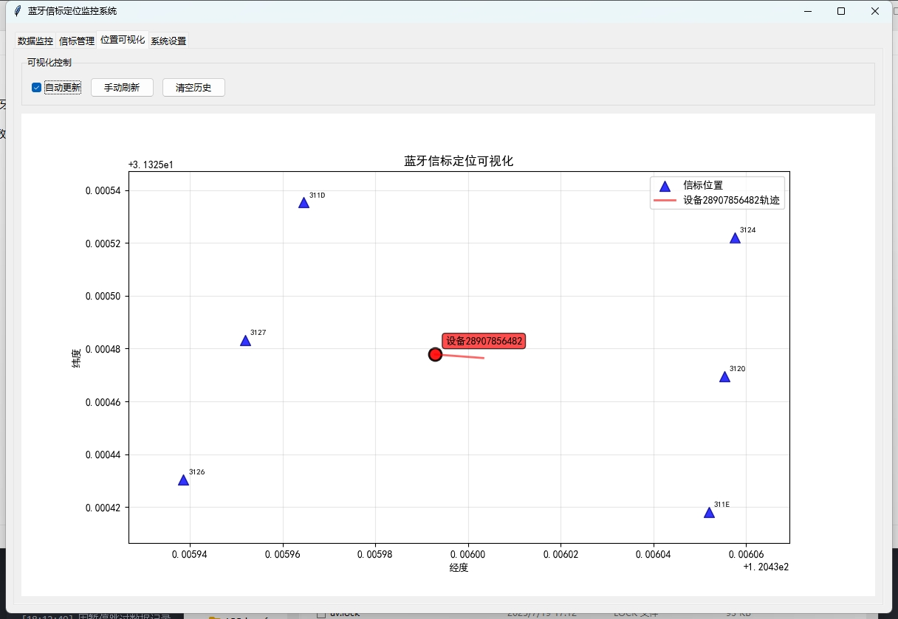

# 蓝牙定位器

为了方便调试mqtt发送过来的蓝牙数据，临时写的小程序。

通过MQTT接收数据，并将原始数据、定位数据分别保存到 `bluetooth\\\_position\\\_data.csv` 和 `terminal\\\_locations.csv` 下，也可以可视化。

MQTT默认订阅主题为 `/device/blueTooth/station/+`，MQTT消息格式如下：

```
ED992B683127,-36,-1;ED992B68311D,-36,-1;ED992B683124,-38,-1;ED992B68311E,-43,-1;ED992B683126,-47,-1;ED992B683120,-56,-1;ED992B683121,-73,-1;ED992B68312C,-79,-1;ED992B683129,-79,-1;ED992B68312D,-80,-1;ED992B68312B,-81,-1;ED992B683122,-84,-1;28907856482
```

首先按照 `;` 分割字符串，除了最后一个项是设备ID，前面的每一项都是蓝牙信息。将前面的每一项按照 `,` 分割，前两项为蓝牙设备ID和RSSI值，第三项为方位角（可选）。





